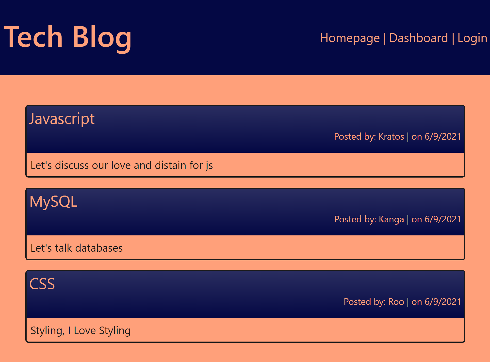

# Tech Blog

  

  ## Description
  A forum where developers can discuss any issues or successes they may be having.
  
  ## Table of Contents
  - [Installation](#Installation)
  
  - [Usage](#Usage)
  
  - [License](#License)
  
  - [Contributing](#Contributing)
  
  - [Test](#Test)
  
  - [Questions](#Questions)
  
  ## Installation
  To install the required dependencies run the following command:
  
      npm i
      
  ## Usage
  Pull down to local computer, npm run seed, npm start or go to deployed page here: 
  [Heroku](https://aqueous-citadel-79400.herokuapp.com/)
  

  Website Preview:
  
  
  GitHub Link: 
  [Tech_Blog](https://github.com/MCM1015/Tech_Blog)
  
  ## License 
  This project is licensed under the [MIT](https://opensource.org/licenses/MIT) license.
  
  ## Contributing
  Do Not Touch.
  
  ## Test
  To run test(s), run the following command:
  
      N/A
  
  ## Questions
  If you have any questions or need to contact me directly please email me at:
  <Mary.C.McClernan@gmail.com>
  
  If you would like to see some of my other projects feel free to checkout my GitHub at:
  [MCM1015](https://github.com/MCM1015)